# 软件工程

## 第一章 软件工程概述

1. **什么是软件？ 软件的特点？**
    
    **什么是软件：**
    
    软件=程序+数据+文档
    
    程序=数据结构+算法
    
    **软件的特点：**
    
    1. 软件是一种逻辑实体
    2. 软件的开发是人的智力的高度发挥，而不是传统意义上的硬件制造。
    3. 软件维护与硬件维修有本质的区别。
    4. 软件的开发和运行常常受到计算机系统的限制，对计算机系统有着不同程度的依赖。
    5. 软件的开发至今尚未完全摆脱手工开发的方式，使软件的开发效率受到限制。
    6. 软件的开发是一个复杂的过程。
    7. 软件的成本非常高昂。
    8. 相当多的软件工作涉及社会因素。
    
2. **软件危机的定义**
    
    计算机软件的开发和维护过程中遇到的一系列严重问题。
    
    *表现：*
    
    1. 对软件的开发成本和进度的估算很不准确。
    2. 用户很不满意。
    3. 质量很不可靠。
    4. 没有适当的文档，软件难以维护。
    5. 软件成本比重上升。
    6. 供不应求：软件开发生产率跟不上计算机应用迅速深入的趋势。

3. **软件危机产生的原因？ 软件危机还存在吗？**

    - **客观：**

       - 逻辑部件
       - 规模庞大
       - 维护数量不断膨胀

   - **主观：**

       - 忽视需求分析
       - 软件开发=程序编写
       - 轻视软件维护

4. **解决软件危机的途径**

   - 应该对软件有一个正确的认识，即软件是程序、数据和文档的集合，抛弃”软件就是程序的错误观念“。
   - 必须认识到软件开发不是一种个体劳动，而应该是一种组织良好、管理严密、各类人员协同配合共同完成的项目。
   - 推广应用在实践中总结出来的开发软件的成功的技术和方法，并且研究探索更好更有效的技术和方法，从而消除计算机发展早期的一些错误做法。
   - 开发更好的软件工具。
   - 总之，为了解决软件危机，既要有**技术措施**，又要有**组织管理措施**。

5. **什么是软件工程**

    软件工程是为了**经济**地获得**可靠**的且能在实际机器上**有效**运行的软件，而建立和使用的完善的工程原理。

    or

   1. 把系统的、规范的、可度量的方法应用于软件开发、运行和维护，也就是工程化应用于软件。
   2. 研究 i 中提到的方法。

6. **软件工程研究的内容是什么**

    如何以系统性的、规范化的、可定量的过程化方法去开发和维护软件（网上搜的）。

    or

    软件工程包含的内容：
   - 一组**方法**
   - 一系列**工具**
     - 软件工具为软件工程方法提供了自动的或半自动的软件支撑环境。
   - 一个**过程**
     - 方法使用的顺序
     - 要求交付的文档资料
     - 为保证质量和适应变化所需要的管理
     - 软件开发各个阶段完成的里程碑

    <!-- todo : find out what -->

7. **提高软件质量的手段**

    软件质量包含：
   - 可维护性
   - 可依赖性
   - 有效性
   - 可用性

8. **什么是软件生命期？**

    一个软件从被提出开始研制到软件最终被废弃不用为止的全过程，成为软件生命周期。

9. **瀑布模型每一阶段的含义，优缺点**

    **含义**
    - 问题定义：弄清用户要解决的问题是什么
    - 可行性研究：为前一阶段提出的问题寻求一至数种在技术上可行，在经济上有较高效益的解决方案
    - 需求分析：弄清用户对系统的全部需求，主要是确定目标系统要具备哪些功能
    - 设计：
      - 总体设计：设计软件结构，即确定程序有哪些模块组成和模块间的关系
      - 详细设计：针对单个模块进行设计
    - 编程：按照选定的语言，把模块的过程性描述翻译为源程序
    - 测试：通过各种类型的测试使软件达到预定的要求
    - 运行与维护：持久满足用户需求

    **优缺点**
    1. 优点：
       - 强调开发的阶段性：阶段见具有顺序性和依赖性
       - 强调早期计划及需求调查：推迟实现的观点
       - 强调评审和产品测试：质量保证的观点
    2. 缺点：
       - 依赖早期的唯一一次需求调查，不能适应需求的变化
       - 由于是单一流程，开发中的经验教训不能反馈应用于本产品的开发过程
       - 风险往往推迟到后期的开发阶段才显露，因而失去及早纠正的机会
       - 文档驱动的，对非专业用户来说是难以阅读和理解的。

10. 快速原型、增量模型的定义、特点

    **快速原型：**

    抛弃型/进化型

    - 定义：所谓快速原型是快速建立起来的可以在计算机上运行的程序，他能完成的功能往往是最终产品能完成的功能的一个子集
    - 特点：快速原型的本质是“快速”，开发人员尽可能快地构建出原型系统，以加速软件开发过程，节约开发成本。（不知道对不对）<!-- todo: find out what -->

    **增量模型**

    - 定义：增量模型是把待开发的软件系统模块化，将每个模块作为一个增量组件，从而分批次地分析、设计、编码和测试这些增量组件。
    - 特点：
    - 优点：
      - 整个产品被分解成若干个构建逐步交付，用户可以不断地看到所开发软件的可运行中间版本。
      - 将早期增量作为原型有助于明确后期增量的需求。
      - 降低开发风险。
      - 重要功能首先交付，从而使得其得到最多的测试。
    - 缺点：
      - 需要软件具备开放式的体系结构。
      - 需求难以在增量实现之前详细定义，因此增量与需求的准确映射以及增量的有效集成会比较困难。
      - 容易退化成边做边改的方式。

11. **敏捷模型解决什么问题？**

    为了使软件开发团队具有高效工作和快速响应的能力

    产生背景：

    软件开发的新挑战：
    - 快速的市场进入时间，要求提高生产效率
    - 快速变化的需求
    - 快速发展的技术

    传统的软件开发方法：
    - 强调过程和文档
    - 对变化的适应能力偏弱

12. **补充**

    软件工程关注于**大型程序**的构造。

    软件工程的中心课题是**控制复杂性**。

    **和谐地合作**是开发软件的关键。

    软件工程的本质特征：
    - 软件工程关注于大型程序的构造
    - 软件工程的中心课题是控制复杂性
    - 软件经常变化
    - 开发软件的效率非常重要
    - 和谐地合作是开发软件的关键
    - 软件必须有效地支持他的用户
    - 在软件工程领域中通常由具有一种文化背景的人替另一种文化背景的人创造产品

---

## 第二章 可行性研究

1. **可行性分析任务是什么？**

    目标：弄清要计算机解决的问题的根本所在，确定新系统的作用域吗，以及项目需要的资源和经费

    任务：在向用户调查的基础上，编写项目任务说明书，作为下一步工作可行性分析的依据

2. **可行性分析的内容？**

   - 技术可行性
   - 经济可行性
   - 操作可行性

3. **经济可行性：代码行技术（loc代码规模统计）**

   1. 确定功能
   2. 算出各个功能代码行数的平均值(a+4m+b)/6

   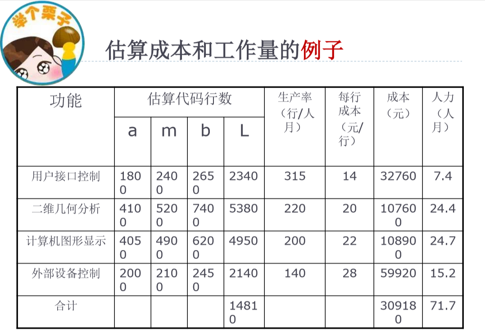

   3. 确定各个子功能的行成本（元/行）和生产力（行/人月）
   4. 计算各个子功能的成本（行*行成本）和人力（行/生产率）
   5. 计算该项目的总代码行数，总成本和总工作量

4. **loc是什么含义，是什么的单位？**

    代码行技术是比较简单的定量估计方法，他把开发每个软件功能的成本和实现这个功能需要的代码行数联系起来。
    通常根据经验和历史数据估计实现一个功能需要的源程序行数。

    是软件规模的度量。

5. **什么是人月，人月是什么的单位，人月与人时的换算关系**

    人月就是一个人工作一个月的工作量，显然是工作量的单位。

    1人月=20人日=20*8人时（**存疑**）
    <!-- todo: find out -->

6. **数据流图包含的要素，数据流图的画法**

    见ppt第二章11-35页

    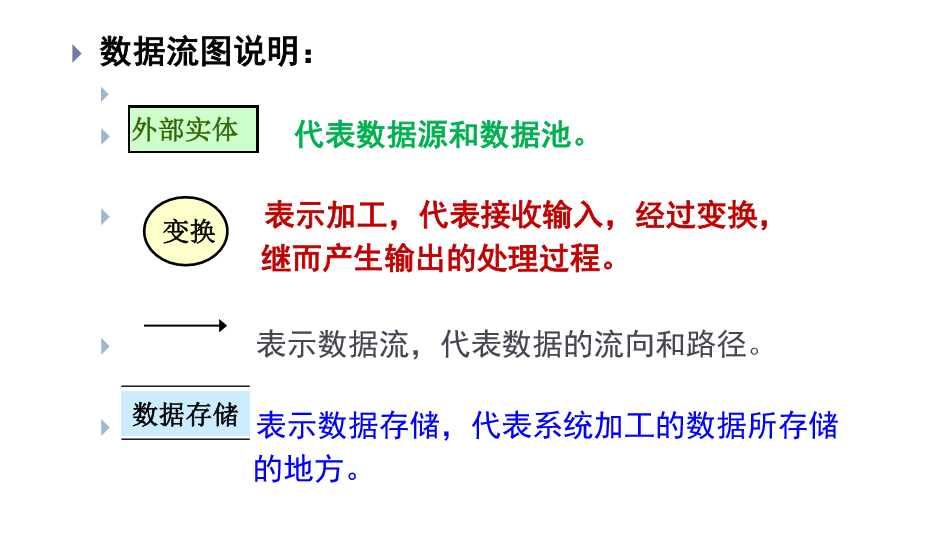

    

7. **画数据流图的注意点**

   - 适当的命名：反应全体的情况，避免空洞的名字
   - 画数据流而不是控制流
   - 先考虑稳定状态
   - 忽略枝节
   - 随时准备重画

   *分层数据流图的注意点：*
   - 父图与子图的输入输出数据流要平衡
   - 之画出加工件交界面的文件，加工内部的文件不必画出
   - 要了解某个加工内部的细节，可以阅读与这个加工的编号相同的那张如
   - 一个加工最多分解成7个子加工
   - 每个加工都足够简单时，分解就可以结束

8. **数据字典的内容**

    一般来说，数据字典应该由对下面四种元素的定义组成：
   1. 数据流
   2. 数据流分量（即数据元素）
   3. 数据存储
   4. 处理
   5. 除定义之外还应包含一些其他信息。典型的情况是在数据字典中记录如下信息：
   **一般信息**（名字，别名，描述等），**定义**（数据类型，长度，结构等），**使用特点**（值的范围，使用频率，使用方式等），
   **控制信息**（来源，用户，使用权，改变权等）和**分组信息**（复结构，从属结构，物理位置等）。

    **定义**：数据流图中包含的所有元素的定义的集合

    **用途**：作为分析阶段的工具

    **与数据流图的联系**：数据字典定义数据流图中出现的所有名字

    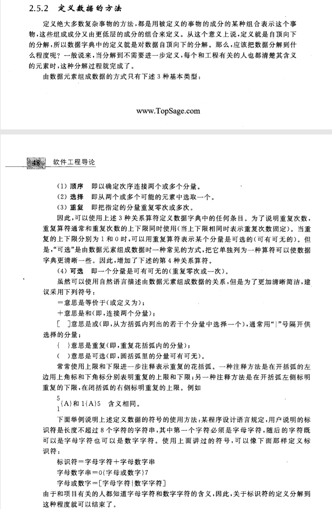

9. **补充**

      1. 可行性研究的步骤
         - 复查系统目标和规模
         - 研究目前正在使用的系统
         - 导出新系统的高层逻辑模型（数据流图）
         - 重新定义问题（复查）
         - 导出和评价供选择的方案
         - 推荐一个方案并说明理由
         - 草拟开发计划
         - 书写文档提交审查

---

## 第三章 需求分析

1. **需求分析的任务**

   1. 确定对系统的综合要求
   2. 分析系统的数据要求
   3. 导出系统的逻辑模型
   4. 修正系统开发计划
   5. 开发原型系统
   6. 验证软件需求分析的正确性
   7. 编写软件需求规格说明书

   **根本任务：确定满足用户需要的系统必须做什么**

2. **需求包含的内容**

    **功能需求：**
    - 业务需求
    - 用户需求
    - 系统需求
    - 功能需求

    **非功能需求：**
    - 性能需求
    - 可靠性和可用性需求
    - 出错处理需求
    - 接口需求
    - 约束
    - 逆向需求（系统不应该做什么）
    - 将来可能提出的要求

   

3. **需求获取的手段方法**

    关键在于与用户交流与沟通

   - 用户面谈
   - 需求专题讨论会
   - 问卷调查
   - 现场考察
   - 原型化方法
   - 基于用例的方法

4. **需求报告的作用是什么，需求报告的主要内容有哪些，写作需求文档的注意事项**

    需求规格说明精确地阐述一个软件系统必须提供的功能和性能以及他要考虑的限制条件。

    **三个作用：**
   - 作为用户和软件开发人员之间的合同，为双方互相了解提供基础。
   - 反映出问题的结构，可以作为软件开发人员设计和编程的基础。
   - 作为验收的依据，即作为选取测试用例和进行形式验证的依据。

   **内容：**

   

   *不应写在SRS中的内容：*
   - 项目开发计划
   - 产品保证计划
   - 软件设计细节

   **注意事项：**
   - 简洁：保持语句和段落的简短
   - 一致：上下文用语一致
   - 具体
   - 必须避免模糊的、主观的术语，减少不确定性
   - 避免使用比较性词汇
   - 不应该将多个需求集中在一个冗长的叙述段落中

5. **需求建模时，除了可以使用数据流图数据字典之外，还有哪些需求建模手段？**

    E-R图；状态迁移图（STD图）（感觉就是个自动机）；以及UML建模工具

6. **判定树、判定表**

    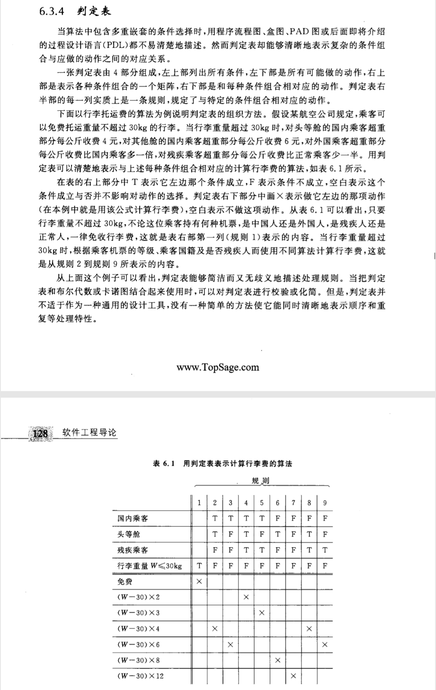

    参考作业题
    <!-- todo 把作业题粘过来 -->

7. **需求文档的质量属性有哪些**

   - **正确性：** 需求说明书对系统的功能、行为、性能等描述必须与用户的期望相吻合，代表了用户真正的需求。
   - **无二义性：** 需求规格说明书中的描述对于所有人都只能有一种明确统一的解释。
   - **完整性：** 需求规格说明书应包含软件需要实现的所有任务，不能遗漏任何信息。
   - **可验证性：** 规格需求说明书中描述的需求都可以运用一些可行的手段对其进行验证和确认。
   - **一致性：** 需求规格说明书对各种需求的描述不能存在矛盾。

8. **什么是SA建模方法，掌握SA建模图**

    <!-- todo: need additional explanation -->

    结构化分析方法（structured analysis）是一种面向数据流、自顶向下、逐步求精进行需求分析的方法。

    *结构化分析放啊适用于分析大型的数据处理系统，特别是企事业管理系统。*

    *结构化分析方法通常与设计阶段的结构化设计方法（structured design）衔接使用。*

    **步骤：** 理解->获得具体模型->抽象出逻辑模型

    SA主要针对数据处理领域，因此系统分析的侧重点在于**功能**分析和**数据**分析，而行为分析使用的较少。

    

9. **补充**

   1. 需求分析的过程
      - 调查研究
      - 分析与综合
      - 书写需求分析的文档
      - 评审

   2. 需求分析阶段的其他工作
      - 确定设计限制
      - 确定验收标准
      - 编写初步用户手册
      - 复查需求说明书

   3. 从哪些方面验证软件需求的正确性：完整性，正确性，一致性，可实现性，可测试性。

   4. 需求验证技术
   - 需求评审
   - 原型评价
   - 测试用例生成

      

      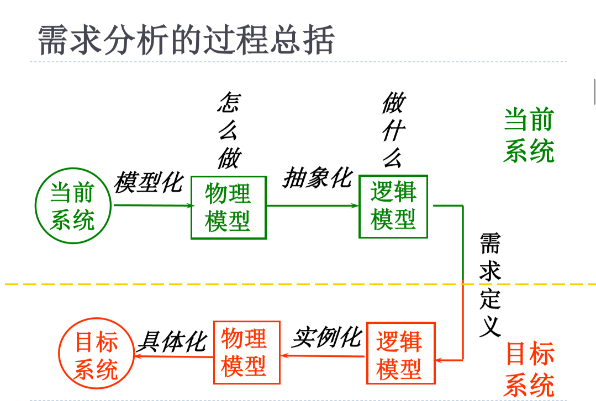

---

## 第五章 总体设计

总体设计的基本目的就是要回答：概括地说，系统应该如何**实现**？因此总体设计又被成为概要设计、初步设计。

**设计不是编码，编码也不是设计**

1. **总体（概要/初步）设计的工作内容是什么？**

   通过这个阶段的工作将划分出组成系统的物理元素——文件、程序、数据库、人工过程和文档等，但每个物理元素都还处在黑盒状态中。
   总体设计的另一项重要任务是设计软件的结构，也就是要确定系统中每个程序是由哪些模块组成的，以及这些模块之间的关系。

   *设计主要设计一下几个方面：*
   - 体系结构设计
   - 详细设计
   - 用户界面设计
   - 数据库设计

2. **模块的定义，模块化设计的重要指导思想是什么？**

    **定义：**  
    用一个名字可以调用的一段可执行程序；  
    模块具有输入和输出，功能，内部数据，程序代码等四个特性；  
    是完成一个独立功能的程序单元。

    **指导思想：** 分解、信息隐藏和实现独立性

    *模块化设计：* 将一个复杂的大系统分解成若干个相对简单的较小的成为子系统的部分。
    可以降低系统的开发难度，增加系统的可维护性。

    *设计原理：*
   - 将系统划分成模块
   - 决定每个模块的功能
   - 决定模块的调用关系
   - 决定模块的界面，即模块之间传递的数据

3. **什么是耦合，具体有哪些耦合方式？**

    耦合是对一个软件结构内不同模块之间互相关联成都的度量。耦合强弱取决于模块间接口的复杂程度、进入或访问一个模块的点以及通过接口的数据。  
    当一个模块发生变化时，对两一个模块的影响很小，则称他们是松散耦合的，反之则称他们是紧密耦合的。

    **耦合方式：**
   - **内容耦合**：两个模块中的一个直接引用了另一个模块的内容
   - **公共耦合**：两个模块之间可以存取相同的公共数据（比如全局变量）
   - **外部耦合**：一组模块都**访问同一全局简单变量**而不是同一全局数据结构，而且不是通过参数表传递该全局变量的信息，则称之为外部耦合
   - **控制耦合**：如果一个模块通过传送开关、标志、名字等控制信息，明显地控制选择另一模块的功能，就是控制耦合
   - **标记耦合**：两个模块之间传数据数据结构（不是简单数据，而是记录、数组等）加以练习，但是被调用模块只需要数据结构中的部分数据项。
   - **数据耦合**：被调用模块的输入输出是简单数据或数据结构（该数据结构中的所有元素都被被调用模块使用）。
   - **非直接耦合**：两个模块之间没有直接联系，而是通过主模块的调用实现。

4. **模块之间联系的原则**

    尽量使用数据耦合，少用控制耦合，限制公共耦合的范围，完全不用内容耦合。

5. **什么是内聚，内聚有哪些类型。设计时应追求什么内聚？**

    内聚标志着一个模块内部各个元素间彼此结合的紧密程度。简单地说，理想内聚的模块制作一件事情。

    **类型：**
   - **偶然内聚**：无关的函数、过程或者数据出现在同一个模块里，模块中各部分之间没有联系或者仅有松散的联系。
     解决方法：拆
   - **逻辑内聚**：逻辑相似的几个函数出现在同一个模块中，调用时由传递的判定参数来确定模块应该执行哪一种功能。
   - **时间内聚**：出现在同一个模块里是由于需要同时执行。
   - **过程内聚**：出现在统同一个模块里是由于处理的顺序。
   - **通信内聚**：出现在同一个模块里是由于操作或者生成同一个数据集。
   - **顺序内聚**：一个元素的输出数据作为下一个元素的输入数据。
   - **功能内聚：所有功能属于一个整体，完成单一的功能。**

    设计时应追求高内聚。

6. **模块化的基本原则**

    - 每个模块执行一个功能
    - 模块间传送数据型参数
    - 模块间共用信息尽量少

7. **模块的评价标准**

    **可分解性**：模块是可分解的
    **可组装性**：模块是可组装的
    **可理解性**：模块可以被独立理解
    **连续性**：某个模块的修改不会导致整个系统的修改
    **保护**：异常限制在模块内

8. **什么是模块的深度广度**

    深度：分层的层数
    宽度：同一层上模块数的最大值

9. **什么是扇入扇出**

    扇入：直接调用该模块的模块数量  
    扇出：一个模块直接调用/控制的模块的数量

    尽可能减少高扇出结构，因为如果一个模块的扇出数过大，则意味着该模块的功能太过复杂。
    扇入越大，说明复用性越好。

10. **什么是控制域作用域**

    控制域指模块本身以及所有直接或者间接从属于它的模块  
    作用域是指模块中一个判断所影响的所有其他模块  
    模块的作用域应该保持在模块的控制域内

11. **模块设计时的启发式规则有哪些**

    - 改进软件结构提高模块独立性
    - 模块规模应适中
    - 深度、宽度、扇入和扇出应适中
    - 模块的作用域应该在控制域内
    - 力争降低模块接口的复杂程度
    - 设计单入口、单出口的模块
    - 模块功能可以预测

12. **什么是变换流，什么是事务流**

    **变换流：** 参考图5.8，信息沿输入通路进入系统，同时由外部形势变换成内部形态，
    进入系统的信息通过变换中心，经过加工处理后再沿输出通路变换成外部形态离开系统，
    当数据流图有这种特征时，这种信息流就叫变换流。

    **事务流：** 参考图5.9，当数据流图具有和图5.9相似的形状时，这种数据流是以事务为中心的，
    也就是说，数据沿输入通路到达一个处理T，这个处理根据输入数据的类型在若干个动作中选出一个执行，
    这类数据流应划分为一类特殊的数据流，成为是物流。T则成为事务中心，他完成一下任务：
    1. 接受输入数据（又称为事务）
    2. 分析事务来确定他的类型
    3. 根据事务类型来选取一条数据通路

    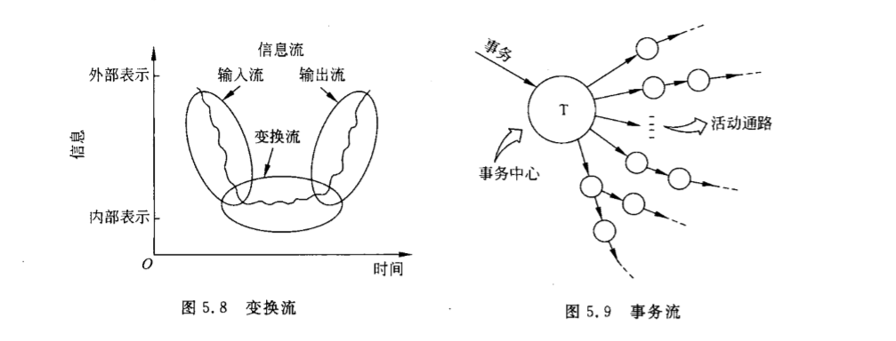

13. **层次图，结构图**

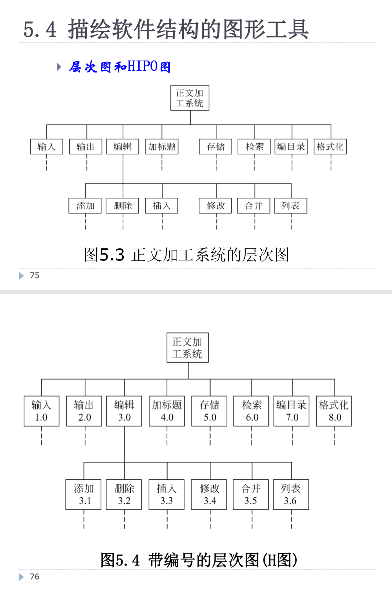

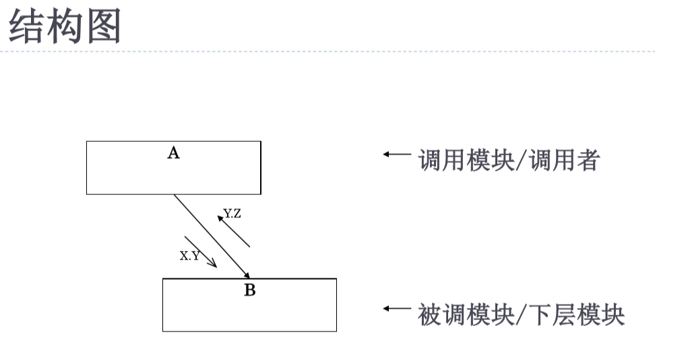

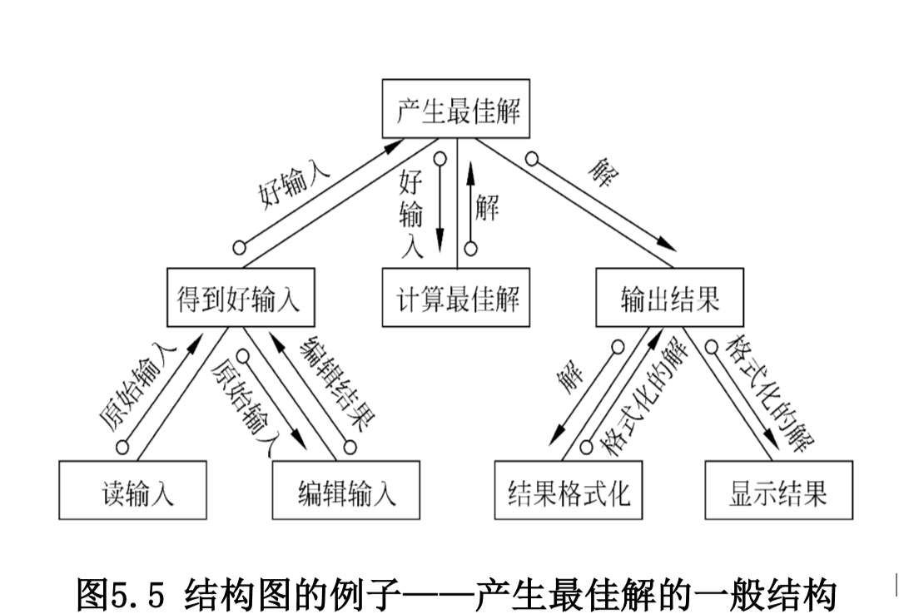

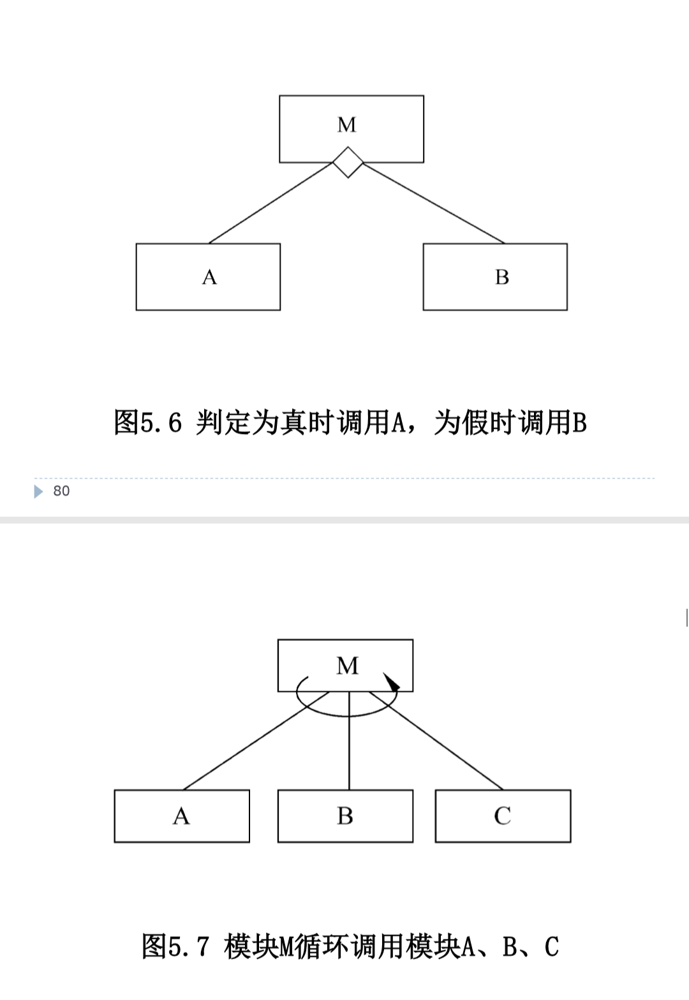

**注意：** 一个模块在结构图中只能出现一次。一般习惯输入模块在左，计算模块在中间，输出模块在右。

14. **补充**

    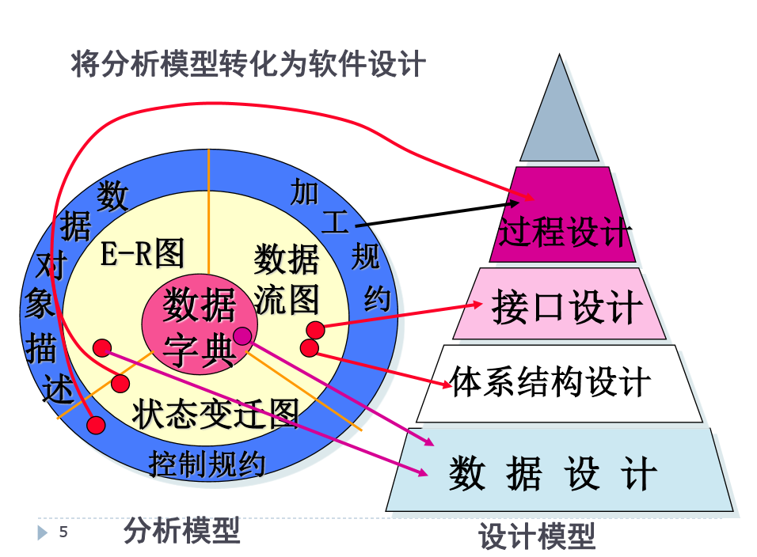

    1. 设计是研究系统的软件**实现问题**，即在分析模型的基础上形成**实现环境下的设计模型**

    2. 实施总体设计的过程
       - 设想供选择的方案
       - 选取合理的方案
       - 推荐最佳方案
       - 功能分解
       - 设计软件结构
       - 数据库设计
       - 制定测试计划
       - 书写文档
       - 审查和复审

    3. SD方法概述
    - 首先研究、分析和审查数据流图，从软件的需求规格说明中弄清数据流加工的过程。
    - 然后根据数据流图决定问题的类型，即确定是变换型还是事务型。针对两种不同的类型分别进行分析处理。
    - 由数据流图推导出系统的初始结构图。
    - 利用一些试探性原则来改进系统的初始结构图，直到得到符合要求的结构图为止。
    - 修改和补充数据词典。
    - 制定测试计划。

    4. SD方法的步骤
    - 第一步是建立符合需求规格说明书要求的初始结构图 （一般由数据流图导出初始结构图）
    - 第二步再用块间联系和块内联系等概念对初始结构图 做进一步改进

    5. SD方法小结
    - 根据问题的结构导出解答的结构，即根据数据流图导出结构图
    - 为控制大型软件的复杂性，将系统分解，组织成适合于计算机实现的层次结构
    - 用块间联系和块内联系作为评价软件结构质量的标准
    - 给出一组设计技巧，如扇入，扇出，模块大小的掌握，作用范围和控制范围等
    - 用结构图直观地描述软件结构，因此易于理解，分析和复查

---

## 第六章 详细设计

1. **什么是SD**

    结构化分析是一种面向功能或面向数据流的需求分析方法，采用自顶向下、逐层分解的方法，建立系统的处理流程。

2. **详细设计的内容是什么**

   - 确定每个模块的算法
   - 确定每一个模块的数据组织
   - 为每个模块设计一组测试用例
   - 编写详细设计说明书

3. **详细设计的工具有哪些,都有哪些优缺点**

   - **程序流程图：**
     - **优点**
       - 独立于任何一种程序设计语言，比较直观和清晰地描述过程的流程控制，易于掌握。
     - **缺点**
       - 由于程序流程图的特点，它本身并不是逐步求精的好工具，因为他容易使程序员过早地考虑程序的控制流程，
       而忽略了程序的全局结构。
       - 程序流程图中用箭头代表控制流，这样使得程序员不受任何约束，可以完全不顾结构程序设计的精神，随意转移控制。
       - 在数据结构表示方面存在不足。
   - **N-S图（盒图）：**
      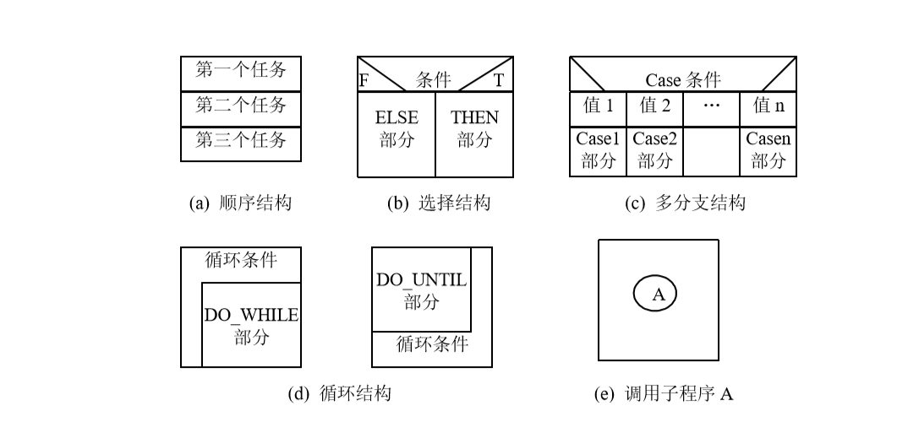
     - **优点**
       - 功能域有明确的规定，并且可以很直观地从NS图上看出来
       - 控制转移不能任意规定，必须遵守结构化程序设计的要求
       - 很容易确定局部数据和全局数据的作用域
       - 很容易表现嵌套关系，也可以表示模块的层次结构
   - **PAD图：**

   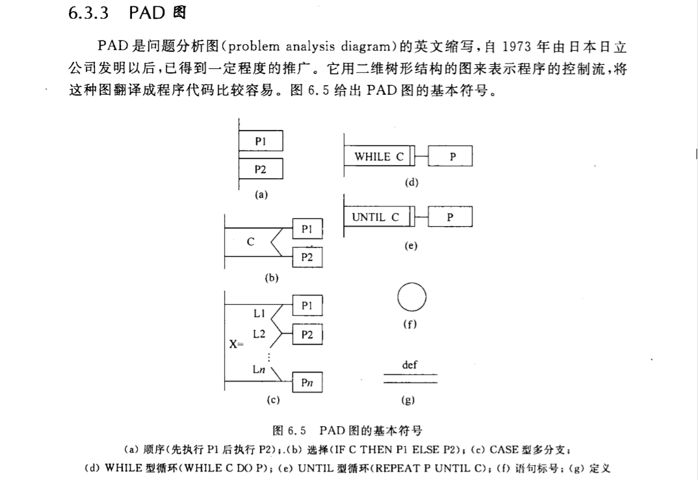

   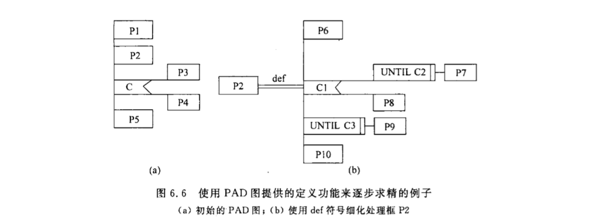

   - **优点**
     - 清晰度和结构化程度高
     - PAD图中最左面的线是程序的主干线，即程序的第一层结构，随着程序层次的增加，PAD图逐渐向右延伸。
     因此，PAD图的结构清晰，可读性强。
     - 例用PAD图设计出的结构必定是结构化的程序
     - 容易将PAD图转换为高级语言原程序
     - PAD图支持自顶向下逐步求精的方法（利用扩充结构）
     - 既可以用于表示程序逻辑，也可以用于描绘数据结构

   - **PDL（过程设计语言，progress design language）：**

   - 是一种“混杂”语言，它使用一种语言（某种自然 语言）的词汇，同时，却使用另一种语言（某种结 构化的程序设计语言）的语法。

   - **优点**
     - 关键字采用固定语法并支持结构化构件、数据说明机 制和模块化；
     - 处理部分采用自然语言描述；
     - 可以说明简单和复杂的数据结构；
     - 子程序的定义与调用规则不受具体接口方式的影响。
   - **缺点**
     - 不如图形工具直观

4. **会将代码、或者程序流程图转换为盒图**

5. **什么是环形复杂度，如何计算程序的环形复杂度**

   McCabe方法根据程序控制流的复杂程度定量度量程序的复杂程度，这样度量出的结果成为程序的环形复杂度。（其实就是数数流图里面有几区域）

   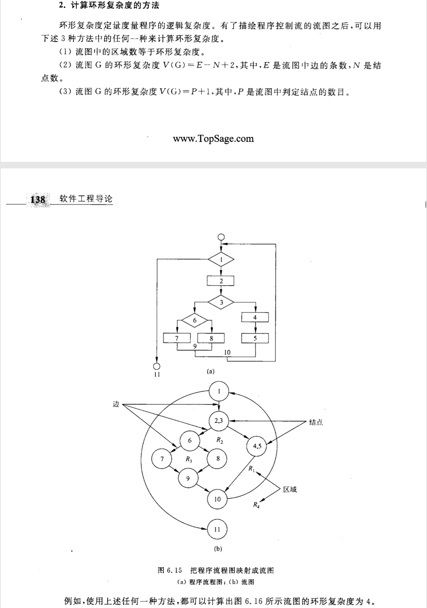

6. **环路复杂度对编程有什么指导意义**

   程序的环路复杂度则取决于程序控制流的复杂度，也就是取决于程序结构的复杂程度。
   当程序内分支或循环个数增加时，则相应地环域复杂度也随之增加。
   因此，它是对测试难度的一种定量度量，也能对软件最终的可靠性给出某种预测。
   环形复杂度高的程序往往是最困难，最容易出错的程序，实践表明，规模以V(G)<=10为宜。

7. **补充**

    详细设计的原则：
   - 模块的逻辑描述正确可靠，清晰易读
   - 采用结构化程序设计方法，改善控制结构，降低程序复杂度，提高程序的可读性，可测试性和可维护性。

---

## 第七章 part 1 编码

编码是一个复杂而迭代的过程，包括程序设计和程序实现。

1. **编程语言共有的特性有哪些**
   1. 名字说明
   2. 类型说明
   3. 初始化
   4. 程序对象的局部性
   5. 程序模块
   6. 循环控制结构
   7. 分支控制给构
   8. 异常处理
   9. 独立编译

<!-- todo: 再找找 -->

2. **什么是编码规范，枚举一些常用的编码规范**

编码规则是程序编码所要遵循的规则，要注意代码的正确性、稳定性、可读性。
要避免使用不易理解的数字，用有意义的标识来替代，不要使用难懂的技巧性很高的语句。
源程序中关系较为紧密的代码应尽可能相邻。

狗哥的编码规范

3. **什么是程序内文档。如何做程序内文档（或者注意点有哪些）**

    所谓的程序内文档包含恰当的标识符、适当的注解和程序的视觉组织等。

   - 选取含义鲜明的名字，使他能正确题是程序对象所代表的实体。
   如果使用缩写，那么缩写的规则应一致，并且给每个缩写加注释。
   - 通常在每个模块的开始处有一段序言性的注解，简要描述模块功能、主要算法、接口特点、重要数据以及开发简史。
   - 插在程序中间与一段程序有段的注解，主要解释包含这段代码的必要性。
   - 应用空格或空行来区分注解和程序。
   - 程序的布局对程序的可读性也有很大的影响，应适当利用阶梯形式使程序的层次清晰。

4. **枚举提高程序局部效率（代码效率）的方法**

    程序效率：执行速度及占用的内存空间

     尽管效率是值得追求的目标，但不应为了非必需的效率提高而牺牲代码的清晰性、可读性和正确性。  
     应记住下面三条准则。
     - 效率是一种性能需求，目标值应当在需求分析 阶段给出。软件效率应以需求为准，不应以人力所 及为准。
     - 好的设计可以提高效率。
     - 代码效率与代码的简单性相关。

   1. 代码效率
      1. 应先简化算术和逻辑的表达式。
      2. 仔细研究嵌套的循环，以确定是否有语句可以从内层往外移。
      3. 尽量避免使用多维数组。
      4. 尽量避免使用指针和复杂的列表。
      5. 使用执行时间短的算术运算。
      6. 即使语言允许，一般也不要采用混合数据类型。
      7. 尽量使用整数表达式和布尔表达式。
   2. 存储器效率
      采用结构化程序设计，将程序功能合理分块，使每个模块或一组密切相关模块的程序体积大小与每页的容量相匹配，
      可减少页面调度、减少内外存交换，提高存储器效率。
   3. 输入/输出效率
      - 所有输入/输出都应该有缓冲，以减少过多的通信次数。
      - 对辅存（如磁盘），应选用最简单的访问方法。
      - 辅存的输入/输出，应该以块为单位进行。
      - 终端和打印机的输入/输出，应当考虑设备的特性，以提高输入/输出的质量和速度。
   4. 数据库访问效率
      - 采用性能高的数据库。
      - 建立合理的索引,避免扫描多余数据，避免表扫描！（例如NOT IN 都是最低效的）。
      - 应尽量避免在 where 子句中使用!=或<>操作符，否则将引擎放弃使用索引而进行全表扫描。
      - 下面的查询也将导致全表扫描：select id from t where name like ‘%abc%’  。

5. **补充**

   1. 程序设计语言的选择常从以下几个方面考虑：
      - 项目的应用领域
      - 算法与计算的复杂性
      - 数据结构的复杂性
      - 效率
      - 可移植性
      - 程序设计人员的水平
      - 构造系统的模式

   2. 编码风格 -变量名的选择
      - 采用有实际意义的变量名，望文知义。（尽量不要使用拼音）
      - 长度原则：最小长度下的最大信息。
      - 不用过于相似的变量名。不要用大小写来区分变量。
      - 变量名中不要带有数字。
      - 同一变量名不要具有多种含义。
      - 显式声明变量。
      - 对变量最好做出注释说明其含义（全程变量，成员变量）。
      - 命名规则尽量与所采用的操作系统或开发工具的风格保持一致。
      - 程序中不要出现标识符完全相同的局部变量和全局变量，尽管两者的作用域不同而不会发生语法错误，但会使人误解。

   3. 编码风格 -表达式的书写
      - 尽量避免复杂的条件测试；
      - 尽量减少对“非”条件的测试；
      - 尽量少用中间变量
      - 注意添加括号澄清计算意图，注意运算符的优先级
      - 注意浮点运算的误差
      - 注意整数运算的特点
      - 调用函数的返回值，特别是异常值应该进行检查处理
      - 如果语句的顺序很重要的话，应该加注释说明

   4. 设计方法论
      - 代码文档化：指编码时适当选择标识符的名字、适当安排注释 和注重程序的整个组织形式。
      - 数据说明：程序或模块在其可执行部分的前面都集中了一些说 明语句 ，出于阅读理解和维护的要求，最好使其规范化，使说 明的先后次序固定 。
      - 语句构造 ：每条语句都应当简单而直接，同时也不应为了追 求运行效率而使代码复杂化，这样会减低程序的可读性。
      - 输入/输出：遵循源程序的输入输出风格。

    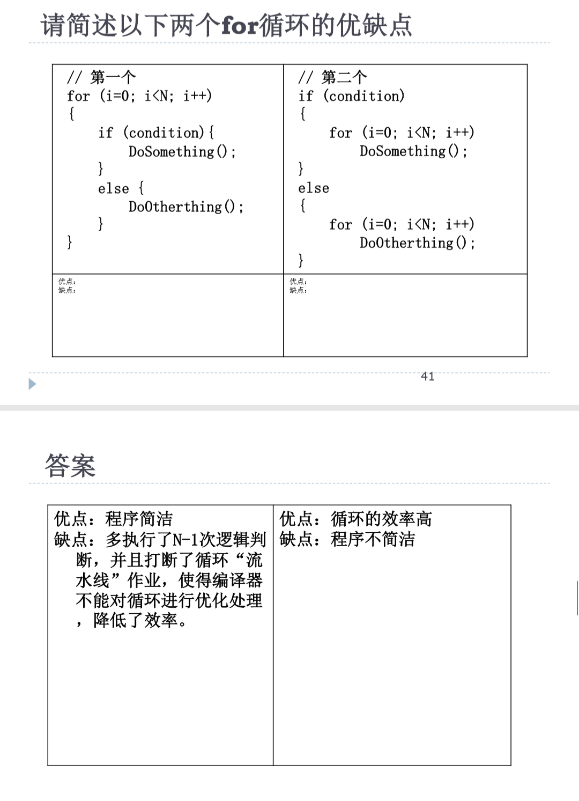

---

## 第七章 part 2 测试

1. **测试的目的，测试和审查（静态测试）的关系**

    目的：
    - 测试时为了**发现程序中的错误**而执行的过程
    - 好的测试方案时极可能发现迄今为止尚未发现的错误的方案
    - 成功的测试是发现了迄今为止尚未发现的错误的方案

   关系：  
   静态检查是在对软件进行分析、检查和审阅，不实际运行被测试的软件  
   动态检查是通过运行软件来检测软件的动态行为和运行结果的正确行

2. **什么是软件缺陷，试举一些软件缺陷的例子**

   - 缺点（defact）
   - 谬误（fault）
   - 问题（problem）
   - 错误（error）
   - 异常（anomaly）
   - 偏差（variance）
   - 失败（failure）
   - 缺陷（bug）

   **软件缺陷的例子：**
   - 程序异常终止；
   - 未达到需求说明书指明的要求；
   - 出现了需求说明书中指明不会出现的错误；
   - 功能超出了需求说明书指明的范围；
   - 未达到需求说明书未指明但是应达到的要求；
   - 难以理解，不易使用，运行速度缓慢；

3. **为什么说：测试发现的错误中的80%很可能是由程序中20%的模块造成的。如何使用这个原理**

<!--   todo 找出为什么   -->
   - pareto原则：测试发现的错误中的80%很可能是由程序中 20%的模块造成的。
   - 应该从“小规模”测试开始，并逐步进行“大规模”测试。
   - 测试用例应由输入数据和预期的输出结果两部分组成，并兼顾合理的输入和不合理的输入数据。
   - 穷举测试是不可能的。
   - 为了达到最佳的测试效果，应该由独立的第三方从事测试 工作。
   - 程序修改后要回归测试。
   - 应长期保留测试用例，直至系统废弃。

4. **什么是白盒测试，什么情况需要进行白盒测试？**

    白盒法：也叫玻璃盒测试，对软件的过程性细节进行细致的检查，这一方法是将测试兑现看作一个打开的盒子，
    它允许测试人员利用内部逻辑结构及有关信息，来设计或者选择测试用例，对程序的**逻辑路径**进行测试。

<!--    todo 什么情况下需要白盒测试    -->

5. **为什么需要白盒测试，只进行功能测试是否可以？**

   为什么：
   - 逻辑错误往往发生在不太经过的程序路径。
   - 打字错误是随机的。

   不可以。由于逻辑错误和不正确假设与一条程序路径被运行的可能性成反比。
   由于我们经常相信某逻辑路径不可能被执行, 而事实上,它可能在正常的情况下被执行。
   由于代码中的笔误是随机且无法杜绝的，因此我们要进行白盒测试。

6. **白盒测试方法有哪些，满足条件覆盖的测试用例，是否一定满足判定覆盖？**

   - 逻辑覆盖（面向单语句）
     - 语句覆盖：每个语句至少被执行一遍
     - 判定覆盖：每个分支至少被执行一遍
     - 条件覆盖：每个条件获得各种可能的结果
     - 判定-条件覆盖
     - 条件组合
   - 路径覆盖（面向语句间控制）

   不一定

   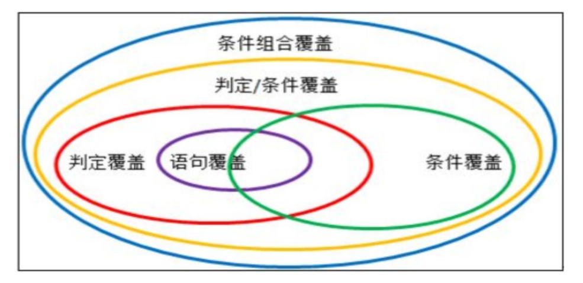

   
<embed src="pdf/whitebox.pdf" width="850" height="600">

7. **什么是基本路径（独立路径），如何寻找基本路径？**

   一条路径是基本路径，如果：
   - 是一条从起始节点到终止节点的路径。
   - 至少包含一条其他基本路径没有包含的边。
   - **注意：** 对于循环而言，基本路径应包含不执行循环和执行一次循环体。
   - 程序的环形复杂度决定了程序中独立路径的个数。**p.s.环形复杂度=独立路径的数量**

   寻找基本路径：
   1. 画出程序的控制流图
   2. 计算流图G的环形复杂度V(G)
   3. 确定只包含独立路径的基本路径集

8. **遇到循环语句，如何进行测试？**

   - 跳过循环
   - 只通过循环一次
   - 通过循环两次
   - 通过循环m次，其中m<n-1，n是允许通过循环的最大次数。
   - 通过循环n-1,n,n+1次

   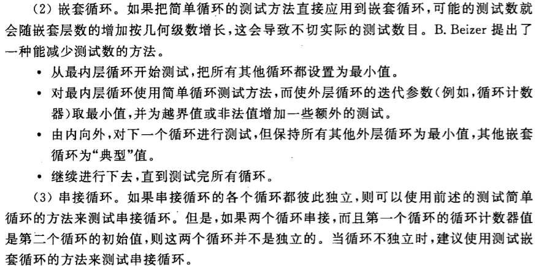

   *补充：* 循环最简单的测试方法，是把循环当分支结构，只测试进入循环和不进入循环体两种情况，这种简化循环意义下的路径覆盖成为“Z路径覆盖”。

9. **代码完成后，应当按照什么样的测试步骤进行测试**

   1. 模块测试（单元测试）
   2. 子系统测试
   3. 系统测试（与子系统测试一起又成为集成测试）
   4. 验收测试（确认测试）
   5. 平行运行

10. **单元测试如何完成**

   模块功能的测试项：模块的功能，主要使用黑盒测试法设计测试项目  
   模块通路的测试项：模块的详细实现和代码，主要使用白盒测试法设计测试项目单

11. **什么是驱动模块，什么是桩模块？**

   模块并不是一个独立的程序，要运行就必须为他开发驱动软件和存根（桩）软件

   - 驱动模块：调用测模块的代称
   - 桩模块：被调用侧模块的代称

   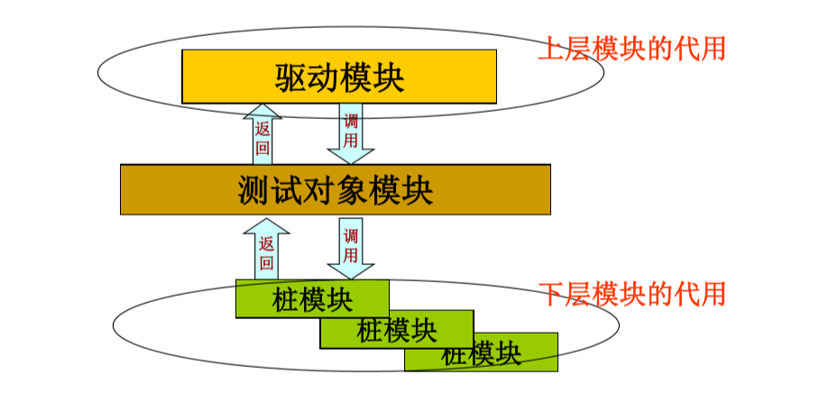

   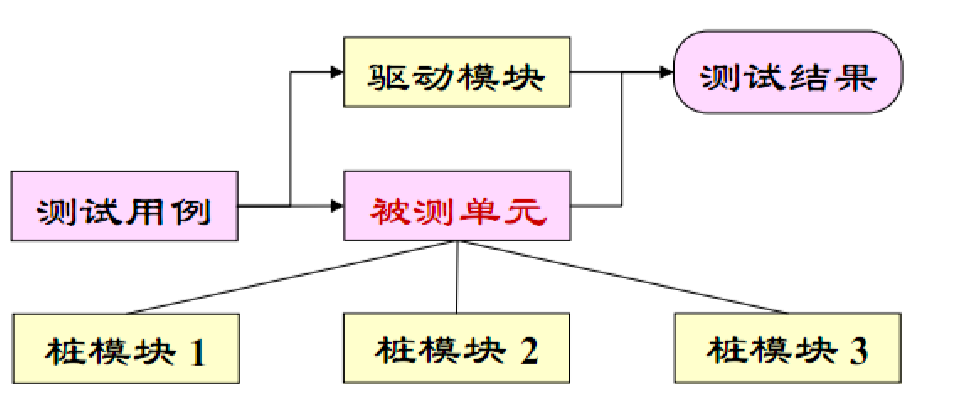

12. **自顶向下集成测试，需要构筑驱动模块还是桩模块？**

    动脑想一下，显然是桩模块。

13. **什么是黑盒测试，黑盒测试有哪些方法？什么情况进行黑盒测试？**

    黑盒测试也称功能测试，它是通过测试来检测每个功能是否都能正常使用。
    在测试中，把程序看作一个不能打开的黑盒子，在完全不考虑程序内部结构和内部特性的情况下，
    在程序接口进行测试，它只检查程序功能是否按照需求规格说明书的规定正常使用，程序是否能适当地接收输入数据而产生正确的输出信息。

    - 等价分类法：程序的输入集合分割为有限的等价类
    - 边缘值法：等价类中的代表值取值时，采用等价类的边界值
    - 错误推测法：输入可能会发生错误的值
    - 因果图法：测试项目的组合
    - 状态迁移法：功能中含有状态迁移的情况使用的测试法

    白盒测试通常在测试过程的早期阶段进行，而黑盒测试主要应用于测试过程的后期。

14. **除功能测试之外，系统测试还需要包含哪些测试（至少枚举3条）**

    - 功能测试（Function Testing）
    - 负荷测试（Stress Testing）
    - 大容量测试（Volume Testing）
    - 存储量测试（Storage Testing）
    - 安全性测试（Security Testing）
    - 性能测试（Performance Testing）
    - 可靠性测试（Reliablity Testing）
    - 恢复测试（Recovery Testing）
    - 使用性测试（Usabiliry Testing）
    - 文档测试（Documentation Testing）
    - 工序测试（Procedure Testing）

15. **什么是回归测试？为什么要进行回归测试？**

    在集成测试过程中每当一个新模块结合进来时，程序就发生了变化：建立了新的数据流路径，可能出现了新的IO操作，
    激活了新的控制逻辑等。这些变化可能使原来工作正常的功能出问题。回归测试就是指重新执行已经做过的测试的某个子集，
    来保证上述变化没有带来非预期的副作用。

    回归测试可以发生在软件测试的任何阶段，包括单元测试、集成测试和系统测试。

16. **α测试和β测试是什么含义？**

    α测试与β测试时在产品正式发布前进行的两种测试：
    - α测试是用户在开发环境下进行的测试
    - β测试是软件的多个用户在实际使用环境中进行的测试

17. **补充**

    1. 从软件错误到软件失效
    软件问题产生的过程：软件错误（error）->软件缺陷（ defect ）->软件故障（ fault ）->软件失效 （ failure ）
    - 软件错误是一种人为错误。
    - 一个软件错误必定产生一个或多个软件缺陷。
    - 当一个软件缺陷被激活时，便产生一个软件故障；同一个软件缺陷在不同条件下被激活，可能产生不同的软件故障。
    - 软件故障如果没有及时的容错措施加以处理，便不可避免地导致软件失效；同一个软件故障在不同条件下可能产生不同的软件失效。

    2. 集成测试策略：
       - 基于层次的集成：自顶向下与自底向上
       - 基于功能的集成：按照功能的优先级逐步将模块加入系统中
       - 基于进度的集成：把最早可获得的代码进行集成
       - 基于使用的集成：通过类的使用关系进行集成

    3. 非渐增式与渐增式测试
       1. 非渐增式测试方法，即：先分别测试每个模块，再把所有模块按设计要求放在一起结合成所要的程序进行测试。
       2. 渐增式测试，即：先把下一个要测试的模块同已经测试好的那些模块结合起来进行测试，测试完以后再把下一个应该测试的模块结合进来测试。
          这种每次增加一个模块的方法实际上同时完成单元测试和集成测试.
          目前在进行集成测试时普遍采用渐增式测试方法。

---

## 第八章 维护

1. **维护的概念**

    维护就是在软件已经交付使用之后，为了改正错误或满足新的需要而修改软件的过程。

2. **维护的种类、各类的特点**

   - 纠错性维护：由于前期的测试不可能揭露软件系统中所有潜在的错误，用户在使用软件时仍将会遇到错误，诊断和改正这些错误的过程称为纠错性维护。
   - 适应性维护：由于新的硬件设备不断推出，操作系统和编译系统也不断地升级，为了使软件能适应新的环境而引起的程序修改和扩充活动称为适应性维护。
   - 完善性维护：在软件的正常使用过程中，用户还会不断提出新的需求。为了满足用户新 的需求而增加软件功能的活动称为完善性维护。
   - 预防性维护：为了改进未来的可维护性和可靠性，或为了给未来的改进奠定更好的基础而修改软件。这项维护活动目前相对较少。

3. **纠错性维护的方法：程序运行发现了错误，如何定位错误、确认问题点？（综合问题，答案在维护和调试里面）**

    通常需要把系统地分析、直觉和运气组合起来。一般来说有三种途径：
   - 蛮干法：最低效，只有其他方法都失败的时候才能使用。打印内存，激活对运行过程的跟踪，到处写输出语句等。
   - 回溯法：回溯法是一种相当常用的调试方法，在小程序调试的过程中十分有效。具体做法是，从发现症状开始，人工沿程序的控制流往回追踪分析源代码，直到找出错误原因为止。
   - 原因排除法：对分查找法、归纳法和演绎法都属于原因排除法。
     - 对分查找法的基本思路是，如果已经知道每个变量在程序内若千个关键点的正确值，则可以用赋值语句或输人语句在程序中点附近“注入”这些变量的正确值，
       然后运行程序并检查所得到的输出。如果输出结果是正确的,则错误原因在程序的前半部分;反之,错误原因在程序的后半部分。对错误原因所在的那部分再重复使用这个方法,
       直到把出错范围缩小到容易诊断的程度为止。
     - 归纳法是从个别现象推断出一般性结论的思维方法。使用这种方法调试程序时,首先把和错误有关的数据组织起来进行分析,以便发现可能的错误原因。然后导出对错误。
       原因的一个或多个假设,并利用已有的数据来证明或排除这些假设。当然,如果已有的数据尚不足以证明或排除这些假设,则需设计并执行一些新的测试用例,以获得更多的数据。
     - 演绎法从一般原理或前提出发,经过排除和精化的过程推导出结论。采用这种方法调试程序时,首先设想出所有可能的出错原因，然后试图用测试来排除每一个假设的原因。
       如果测试表明某个假设的原因可能是真的原因,则对数据进行细化以准确定位错误。

   上述3种调试途径都可以使用调试工具辅助完成,但是工具并不能代替对全部设计文档和源程序的仔细分析与评估。
   如果用遍了各种调试方法和调试工具却仍然找不出错误原因，则应该向同行求助。

4. **修改错误代码的注意点有哪些？试着枚举至少3条**

   - 设计思想的一致性
   - 修改的处所尽可能的少，不要比需要修改的地方多
   - 尽量不使用共享系统中的已有变量，而使用局部量
   - 不要建立公用子程序，而建立各自独立的子程序
   - 坚持修改后的复审
   - 建立修改文档
   - 注意修改相应的文档

5. **什么是再工程,什么是逆向工程**

    软件再工程是一类软件工程活动，是一个工程过程, 它将逆向工程、重构和正向工程组合起来,将现存系统重新构造为新的形式.

    

    

    软件的逆向工程是分析程序以便在比源代码更高的抽象层次上创建出程序的某种表示的过程,
    也就是说,逆向工程是一个恢复设计结果的过程,逆向工程工具从现存的程序代码中抽取有关数据、体系结构和处理过程的设计信息。

6. **补充**

   1. 维护的目的
   - 交付后品质的早期安定化
   - 本期管理的结果可以回馈到下期的开发过程，提高下期的开发品质
   - 提高故障对应能力以提高顾客满意度

   2. 软件的可维护性
   - 可理解性
   - 可测试性
   - 可修改性
   - 可移植性
   - 可重用性

   3. 软件再工程过程模型所定义的6类活动
   - 库存目录分析
   - 文档重构
   - 逆向工程
   - 代码重构
   - 数据重构
   - 正向工程

---

## 第十三章 管理

1. **软件项目管理的内容包含哪些。至少枚举3条**

   - 估算软件规模
   - 工作量估算
   - 进度计划
     - 估算开发时间
     - Gantt图
   - 人员组织
   - 质量保证
   - 软件配置管理
   - 能力成熟度模型

2. **甘特图一般用来描述什么内容？试举例说明**

    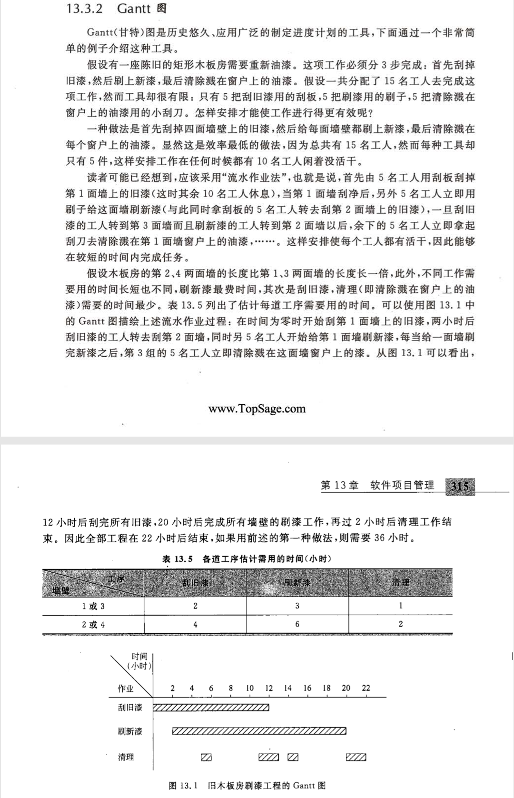

3. **作为一个合格的软件开发人员的条件有哪些，试枚举5条以上**

   - 牢固掌握计算机软件的基本知识和技能。
   - 善于分析、综合问题，具有严密的逻辑思维能力。
   - 工作踏实、细致，遵循标准和规范，具有严格的科学作风。
   - 工作中表现出耐心、毅力和责任心。
   - 善于听取别人意见，善于与周围人员团结协作，建立良好的人际关系。
   - 具有良好的书面和口头表达能力。

4. **评价软件质量的因素（试枚举评价软件质量的方面）**

    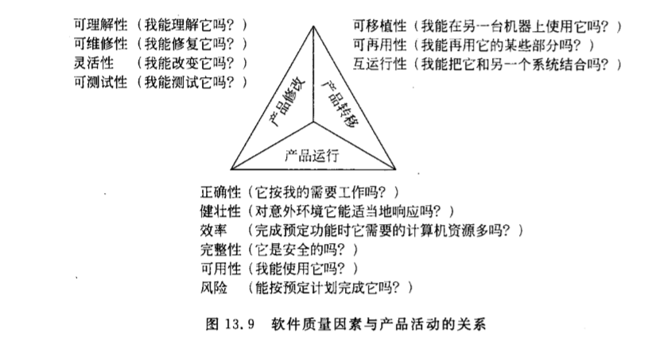

    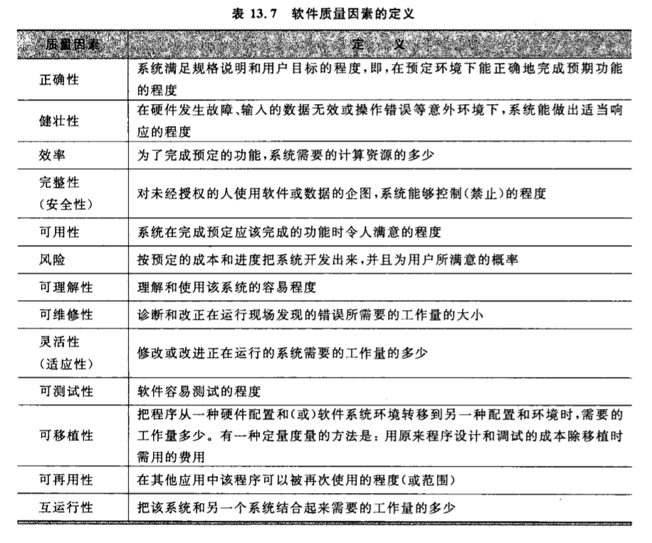

5. **什么是SQA**

    软件质量保证（software quality assurance)

6. **软件配置管理的目标、内容、和对象**

    软件配置管理（Software Configuration Management，SMC）的主要目标是使软件的变更和修改可以更容易被适应，并减少当变更必须发生时所需花费的工作量。

    配置管理的内容
   - 标识变化；
   - 控制变化；
   - 确保适当地实现了变化；
   - 向需要知道这类信息的人报告变化。

    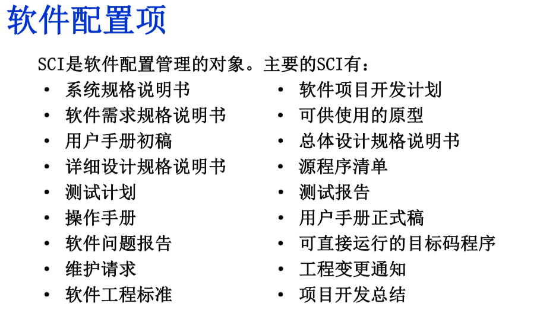

7. **配置管理工具举例**

    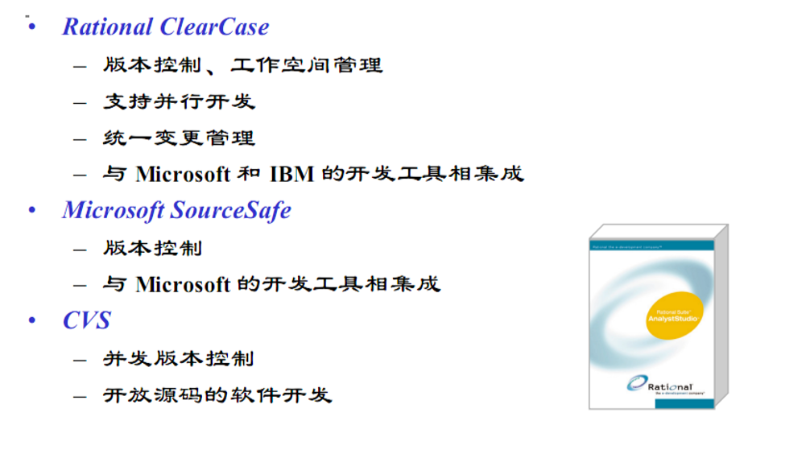

8. **基线的概念**

    基线是已经通过了正式复审的规格说明或者中间产品，它可以作为进一步开发的基础，并且只有通过正式的变化控制才能改变。  
    基线标志着开发过程的各个里程碑。

    

9. **能力成熟度模型（Capability Maturity Model ，CMM）的5个级别**

    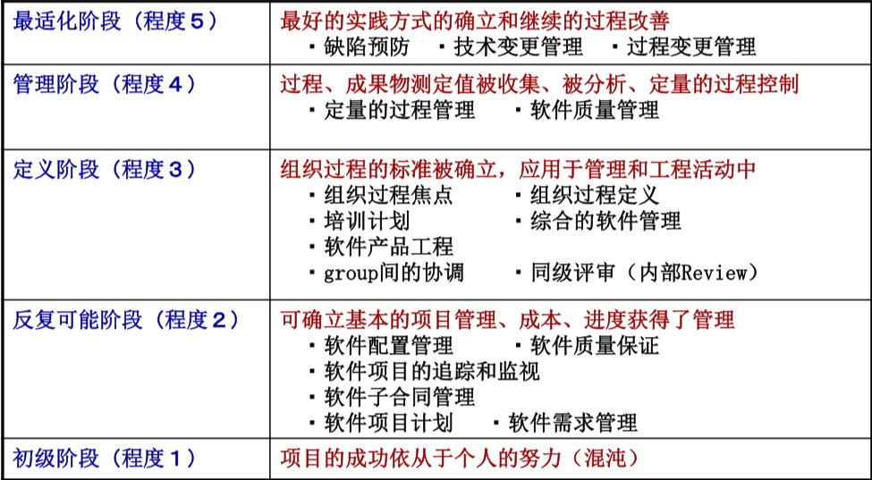

10. **如何确保软件的质量（综述题目）**

    确保软件质量的主要措施有：基于非执行的测试（也成为复审或评审），基于执行的测试（以前讲过的软件测试）和程序正确性证明。
    复审主要用来保证在编码之前各阶段产生的文档的质量；基于执行的测试需要在程序编写出来后执行，他是保证软件质量的最后一道防线；
    程序正确行证明使用数学方法严格证明程序是否与他的说明完全一致。

    参加软件质量保证的工作人员可以划分成一下两类：
    - 软件工程师通过先进的技术方法和度量，进行正式的技术复审以及完成计划周密的软件测试来保证软件质量。
    - SQA小组的职责是辅助软件工程师以获得高质量的软件产品，其从事的软件质量保证活动主要是：计划，监督，记录，分析和报告。
      简而言之，SQA小组的作用是，通过保证软件开发过程的质量来保证软件产品本身的质量。

    正式技术复审可以较早发现软件错误，从而防止错误被传播到软件过程的后续阶段。正式技术复审包括走查和审查等具体方法。

    走查主要有两种形式：
    - 参与者驱动法：参与者按照实现准备好的列表，提出他们不理解的术语或者不正确的术语。文档编写组的成员要么承认确实有错误，要么对质疑做出解释。
    - 文档驱动发：文档编写者向走查组成员仔细解释文档，走查组成员在此过程中向文档编写人员提出质疑。

    审查过程通常包含5个步骤：
    - 综述：有负责编写文档的一名成员向审查组综述文档。
    - 准备：审查组成员仔细阅读文档，列出文档中的错误并将错误分级。
    - 审查：审查组成员仔细走查整个文档，并出具一份审查报告。
    - 返工：文档作者负责解决审查报告中出现的问题。
    - 跟踪：审查组必须确保文档中提出的每个问题都得到了解决（要么修正了文档，要么澄清了被误解的条目），并确保没有引入新错误。

<!--    todo 需要补充    -->

11. **补充**

    1. cocomo模型，参见ppt

    2. 软件质量保证措施
       - 基于非执行的测试（也称为复审或评审）
       - 基于执行的测试（即以前讲过的软件测试）
       - 程序正确性证明

---