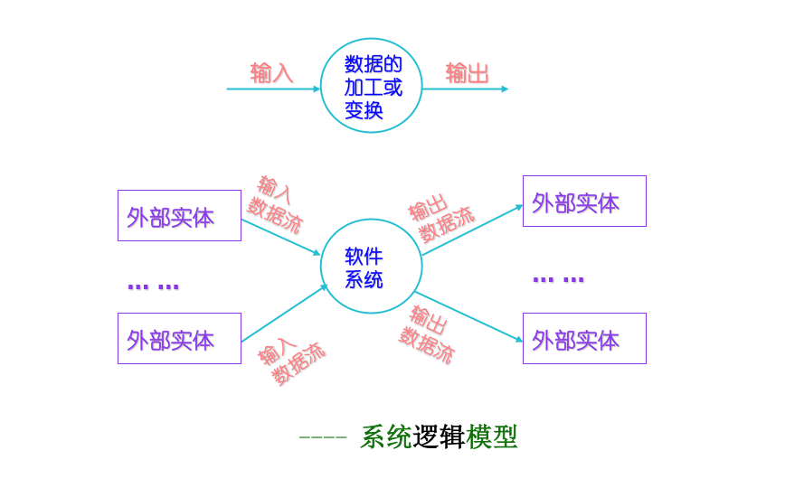
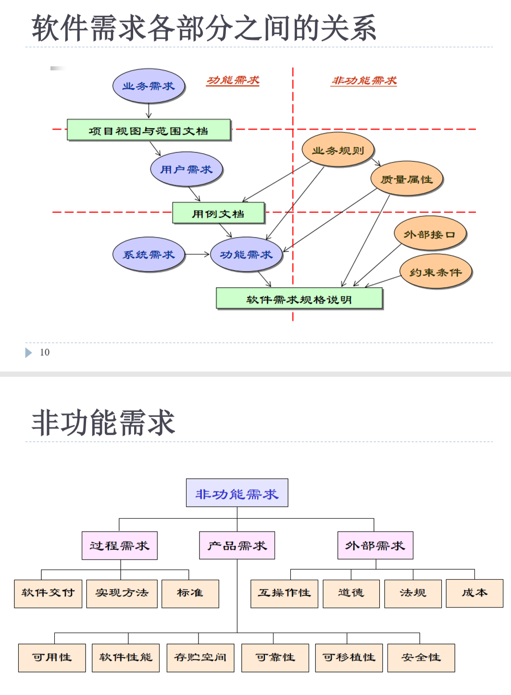
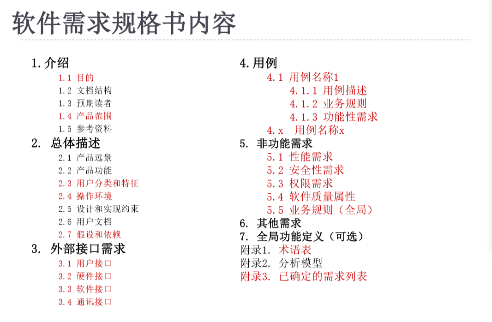
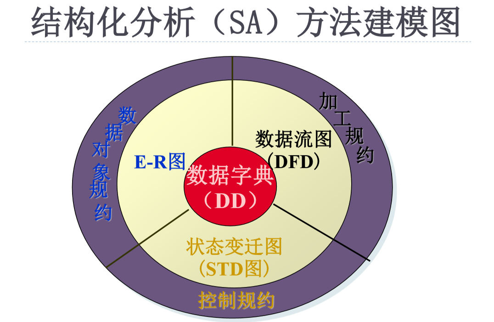
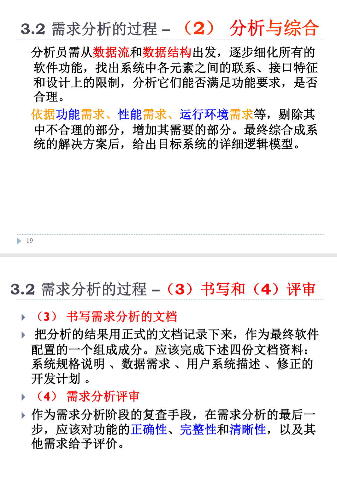

# 软件工程

## 第一章 软件工程概述

1. **什么是软件？ 软件的特点？**
    
    **什么是软件：**
    
    软件=程序+数据+文档
    
    程序=数据结构+算法
    
    **软件的特点：**
    
    1. 软件是一种逻辑实体
    2. 软件的开发是人的智力的高度发挥，而不是传统意义上的硬件制造。
    3. 软件维护与硬件维修有本质的区别。
    4. 软件的开发和运行常常受到计算机系统的限制，对计算机系统有着不同程度的依赖。
    5. 软件的开发至今尚未完全摆脱手工开发的方式，使软件的开发效率受到限制。
    6. 软件的开发是一个复杂的过程。
    7. 软件的成本非常高昂。
    8. 相当多的软件工作涉及社会因素。
    
2. **软件危机的定义**
    
    计算机软件的开发和维护过程中遇到的一系列严重问题。
    
    *表现：*
    
    1. 对软件的开发成本和进度的估算很不准确。
    2. 用户很不满意。
    3. 质量很不可靠。
    4. 没有适当的文档，软件难以维护。
    5. 软件成本比重上升。
    6. 供不应求：软件开发生产率跟不上计算机应用迅速深入的趋势。

3. **软件危机产生的原因？ 软件危机还存在吗？**

    - **客观：**

       - 逻辑部件
       - 规模庞大
       - 维护数量不断膨胀

   - **主观：**

       - 忽视需求分析
       - 软件开发=程序编写
       - 轻视软件维护

4. **解决软件危机的途径**

   - 应该对软件有一个正确的认识，即软件是程序、数据和文档的集合，抛弃”软件就是程序的错误观念“。
   - 必须认识到软件开发不是一种个体劳动，而应该是一种组织良好、管理严密、各类人员协同配合共同完成的项目。
   - 推广应用在实践中总结出来的开发软件的成功的技术和方法，并且研究探索更好更有效的技术和方法，从而消除计算机发展早期的一些错误做法。
   - 开发更好的软件工具。
   - 总之，为了解决软件危机，既要有**技术措施**，又要有**组织管理措施**。

5. **什么是软件工程**

    软件工程是为了**经济**地获得**可靠**的且能在实际机器上**有效**运行的软件，而建立和使用的完善的工程原理。

    or

   1. 把系统的、规范的、可度量的方法应用于软件开发、运行和维护，也就是工程化应用于软件。
   2. 研究 i 中提到的方法。

6. **软件工程研究的内容是什么**

    如何以系统性的、规范化的、可定量的过程化方法去开发和维护软件（网上搜的）。

    or

    软件工程包含的内容：
   - 一组**方法**
   - 一系列**工具**
     - 软件工具为软件工程方法提供了自动的或半自动的软件支撑环境。
   - 一个**过程**
     - 方法使用的顺序
     - 要求交付的文档资料
     - 为保证质量和适应变化所需要的管理
     - 软件开发各个阶段完成的里程碑

    <!-- todo : find out what -->

7. **提高软件质量的手段**

    软件质量包含：
   - 可维护性
   - 可依赖性
   - 有效性
   - 可用性

8. **什么是软件生命期？**

    一个软件从被提出开始研制到软件最终被废弃不用为止的全过程，成为软件生命周期。

9. **瀑布模型每一阶段的含义，优缺点**

    **含义**
    - 问题定义：弄清用户要解决的问题是什么
    - 可行性研究：为前一阶段提出的问题寻求一至数种在技术上可行，在经济上有较高效益的解决方案
    - 需求分析：弄清用户对系统的全部需求，主要是确定目标系统要具备哪些功能
    - 设计：
      - 总体设计：设计软件结构，即确定程序有哪些模块组成和模块间的关系
      - 详细设计：针对单个模块进行设计
    - 编程：按照选定的语言，把模块的过程性描述翻译为源程序
    - 测试：通过各种类型的测试使软件达到预定的要求
    - 运行与维护：持久满足用户需求

    **优缺点**
    1. 优点：
       - 强调开发的阶段性：阶段见具有顺序性和依赖性
       - 强调早期计划及需求调查：推迟实现的观点
       - 强调评审和产品测试：质量保证的观点
    2. 缺点：
       - 依赖早期的唯一一次需求调查，不能适应需求的变化
       - 由于是单一流程，开发中的经验教训不能反馈应用于本产品的开发过程
       - 风险往往推迟到后期的开发阶段才显露，因而失去及早纠正的机会
       - 文档驱动的，对非专业用户来说是难以阅读和理解的。

10. 快速原型、增量模型的定义、特点

    **快速原型：**

    抛弃型/进化型

    - 定义：所谓快速原型是快速建立起来的可以在计算机上运行的程序，他能完成的功能往往是最终产品能完成的功能的一个子集
    - 特点：<!-- todo: find out what -->

    **增量模型**

    - 定义：增量模型是把待开发的软件系统模块化，将每个模块作为一个增量组件，从而分批次地分析、设计、编码和测试这些增量组件。
    - 特点：
    - 优点：
      - 整个产品被分解成若干个构建逐步交付，用户可以不断地看到所开发软件的可运行中间版本。
      - 将早期增量作为原型有助于明确后期增量的需求。
      - 降低开发风险。
      - 重要功能首先交付，从而使得其得到最多的测试。
    - 缺点：
      - 需要软件具备开放式的体系结构。
      - 需求难以在增量实现之前详细定义，因此增量与需求的准确映射以及增量的有效集成会比较困难。
      - 容易退化成边做边改的方式。

11. **敏捷模型解决什么问题？**

    为了使软件开发团队具有高效工作和快速响应的能力

    产生背景：

    软件开发的新挑战：
    - 快速的市场进入时间，要求提高生产效率
    - 快速变化的需求
    - 快速发展的技术

    传统的软件开发方法：
    - 强调过程和文档
    - 对变化的适应能力偏弱

12. **补充**

    软件工程关注于**大型程序**的构造。

    软件工程的中心课题是**控制复杂性**。

    **和谐地合作**是开发软件的关键。

---

## 第二章 可行性研究

1. **可行性分析任务是什么？**

    目标：弄清要计算机解决的问题的根本所在，确定新系统的作用域吗，以及项目需要的资源和经费

    任务：在向用户调查的基础上，编写项目任务说明书，作为下一步工作可行性分析的依据

2. **可行性分析的内容？**

   - 技术可行性
   - 经济可行性
   - 操作可行性

3. **经济可行性：代码行技术（loc代码规模统计）**

   1. 确定功能
   2. 算出各个功能代码行数的平均值(a+4m+b)/6

   

   3. 确定各个子功能的行成本（元/行）和生产力（行/人月）
   4. 计算各个子功能的成本（行*行成本）和人力（行/生产率）
   5. 计算该项目的总代码行数，总成本和总工作量

4. **loc是什么含义，是什么的单位？**

    代码行技术是比较简单的定量估计方法，他把开发每个软件功能的成本和实现这个功能需要的代码行数联系起来。
    通常根据经验和历史数据估计实现一个功能需要的源程序行数。

    是软件规模的度量。

5. **什么是人月，人月是什么的单位，人月与人时的换算关系**

    人月就是一个人工作一个月的工作量，显然是工作量的单位。

    1人月=20人日=20*8人时（**存疑**）
    <!-- todo: find out -->

6. **数据流图包含的要素，数据流图的画法**

    见ppt第二章11-35页

    

    

7. **画数据流图的注意点**

   - 适当的命名：反应全体的情况，避免空洞的名字
   - 画数据流而不是控制流
   - 先考虑稳定状态
   - 忽略枝节
   - 随时准备重画

   *分层数据流图的注意点：*
   - 父图与子图的输入输出数据流要平衡
   - 之画出加工件交界面的文件，加工内部的文件不必画出
   - 要了解某个加工内部的细节，可以阅读与这个加工的编号相同的那张如
   - 一个加工最多分解成7个子加工
   - 每个加工都足够简单时，分解就可以结束

8. **数据字典的内容**

    一般来说，数据字典应该由对下面四种元素的定义组成：
   1. 数据流
   2. 数据流分量（即数据元素）
   3. 数据存储
   4. 处理
   5. 除定义之外还应包含一些其他信息。典型的情况是在数据字典中记录如下信息：
   **一般信息**（名字，别名，描述等），**定义**（数据类型，长度，结构等），**使用特点**（值的范围，使用频率，使用方式等），
   **控制信息**（来源，用户，使用权，改变权等）和**分组信息**（复结构，从属结构，物理位置等）。

    **定义**：数据流图中包含的所有元素的定义的集合

    **用途**：作为分析阶段的工具

    **与数据流图的联系**：数据字典定义数据流图中出现的所有名字

    

9. **补充**

      1. 可行性研究的步骤
         - 复查系统目标和规模
         - 研究目前正在使用的系统
         - 导出新系统的高层逻辑模型（数据流图）
         - 重新定义问题（复查）
         - 导出和评价供选择的方案
         - 推荐一个方案并说明理由
         - 草拟开发计划
         - 书写文档提交审查

---

## 第三章 需求分析

1. **需求分析的任务**

   1. 确定对系统的综合要求
   2. 分析系统的数据要求
   3. 导出系统的逻辑模型
   4. 修正系统开发计划
   5. 开发原型系统
   6. 验证软件需求分析的正确性
   7. 编写软件需求规格说明书

   **根本任务：确定满足用户需要的系统必须做什么**

2. **需求包含的内容**

    **功能需求：**
    - 业务需求
    - 用户需求
    - 系统需求
    - 功能需求

    **非功能需求：**
    - 性能需求
    - 可靠性和可用性需求
    - 出错处理需求
    - 接口需求
    - 约束
    - 逆向需求（系统不应该做什么）
    - 将来可能提出的要求

   

3. **需求获取的手段方法**

    关键在于与用户交流与沟通

   - 用户面谈
   - 需求专题讨论会
   - 问卷调查
   - 现场考察
   - 原型化方法
   - 基于用例的方法

4. **需求报告的作用是什么，需求报告的主要内容有哪些，写作需求文档的注意事项**

    需求规格说明精确地阐述一个软件系统必须提供的功能和性能以及他要考虑的限制条件。

    **三个作用：**
   - 作为用户和软件开发人员之间的合同，为双方互相了解提供基础。
   - 反映出问题的结构，可以作为软件开发人员设计和编程的基础。
   - 作为验收的依据，即作为选取测试用例和进行形式验证的依据。

   **内容：**

   

   *不应写在SRS中的内容：*
   - 项目开发计划
   - 产品保证计划
   - 软件设计细节

   **注意事项：**
   - 简洁：保持语句和段落的简短
   - 一致：上下文用语一致
   - 具体
   - 必须避免模糊的、主观的术语，减少不确定性
   - 避免使用比较性词汇
   - 不应该将多个需求集中在一个冗长的叙述段落中

5. **需求建模时，除了可以使用数据流图数据字典之外，还有哪些需求建模手段？**

    E-R图；状态迁移图（STD图）（感觉就是个自动机）；以及UML建模工具

6. **判定树、判定表**

    参考作业题
    <!-- todo 把作业题粘过来 -->

7. **需求文档的质量属性有哪些**

   - **正确性：** 需求说明书对系统的功能、行为、性能等描述必须与用户的期望相吻合，代表了用户真正的需求。
   - **无二义性：** 需求规格说明书中的描述对于所有人都只能有一种明确统一的解释。
   - **完整性：** 需求规格说明书应包含软件需要实现的所有任务，不能遗漏任何信息。
   - **可验证性：** 规格需求说明书中描述的需求都可以运用一些可行的手段对其进行验证和确认。
   - **一致性：** 需求规格说明书对各种需求的描述不能存在矛盾。

8. **什么是SA建模方法，掌握SA建模图**

    <!-- todo: need additional explanation -->

    结构化分析方法（structured analysis）是一种面向数据流、自顶向下、逐步求精进行需求分析的方法。

    *结构化分析放啊适用于分析大型的数据处理系统，特别是企事业管理系统。*

    *结构化分析方法通常与设计阶段的结构化设计方法（structured design）衔接使用。*

    **步骤：** 理解->获得具体模型->抽象出逻辑模型

    SA主要针对数据处理领域，因此系统分析的侧重点在于**功能**分析和**数据**分析，而行为分析使用的较少。

    

9. **补充**

   1. 需求分析的过程
      - 调查研究
      - 分析与综合
      - 书写需求分析的文档
      - 评审

   2. 需求分析阶段的其他工作
      - 确定设计限制
      - 确定验收标准
      - 编写初步用户手册
      - 复查需求说明书

   3. 从哪些方面验证软件需求的正确性：完整性，正确性，一致性，可实现性，可测试性。

   4. 需求验证技术
   - 需求评审
   - 原型评价
   - 测试用例生成

      

      

---

## 第五章 总体设计

总体设计的基本目的就是要回答：概括地说，系统应该如何**实现**？因此总体设计又被成为概要设计、初步设计。

**设计不是编码，编码也不是设计**

1. **总体（概要/初步）设计的工作内容是什么？**

   通过这个阶段的工作将划分出组成系统的物理元素——文件、程序、数据库、人工过程和文档等，但每个物理元素都还处在黑盒状态中。
   总体设计的另一项重要任务是设计软件的结构，也就是要确定系统中每个程序是由哪些模块组成的，以及这些模块之间的关系。

   *设计主要设计一下几个方面：*
   - 体系结构设计
   - 详细设计
   - 用户界面设计
   - 数据库设计

2. **模块的定义，模块化设计的重要指导思想是什么？**

    **定义：**  
    用一个名字可以调用的一段可执行程序；  
    模块具有输入和输出，功能，内部数据，程序代码等四个特性；  
    是完成一个独立功能的程序单元。

    **指导思想：** 分解、信息隐藏和实现独立性

    *模块化设计：* 将一个复杂的大系统分解成若干个相对简单的较小的成为子系统的部分。
    可以降低系统的开发难度，增加系统的可维护性。

    *设计原理：*
   - 将系统划分成模块
   - 决定每个模块的功能
   - 决定模块的调用关系
   - 决定模块的界面，即模块之间传递的数据

3. **什么是耦合，具体有哪些耦合方式？**

    耦合是对一个软件结构内不同模块之间互相关联成都的度量。耦合强弱取决于模块间接口的复杂程度、进入或访问一个模块的点以及通过接口的数据。  
    当一个模块发生变化时，对两一个模块的影响很小，则称他们是松散耦合的，反之则称他们是紧密耦合的。

    **耦合方式：**
   - **内容耦合**：两个模块中的一个直接引用了另一个模块的内容
   - **公共耦合**：两个模块之间可以存取相同的公共数据（比如全局变量）
   - **外部耦合**：一组模块都**访问同一全局简单变量**而不是同一全局数据结构，而且不是通过参数表传递该全局变量的信息，则称之为外部耦合
   - **控制耦合**：如果一个模块通过传送开关、标志、名字等控制信息，明显地控制选择另一模块的功能，就是控制耦合
   - **标记耦合**：两个模块之间传数据数据结构（不是简单数据，而是记录、数组等）加以练习，但是被调用模块只需要数据结构中的部分数据项。
   - **数据耦合**：被调用模块的输入输出是简单数据或数据结构（该数据结构中的所有元素都被被调用模块使用）。
   - **非直接耦合**：两个模块之间没有直接联系，而是通过主模块的调用实现。

4. **模块之间联系的原则**

    尽量使用数据耦合，少用控制耦合，限制公共耦合的范围，完全不用内容耦合。

5. **什么是内聚，内聚有哪些类型。设计时应追求什么内聚？**

    内聚标志着一个模块内部各个元素间彼此结合的紧密程度。简单地说，理想内聚的模块制作一件事情。

    **类型：**
   - **偶然内聚**：无关的函数、过程或者数据出现在同一个模块里，模块中各部分之间没有联系或者仅有松散的联系。
     解决方法：拆
   - **逻辑内聚**：逻辑相似的几个函数出现在同一个模块中，调用时由传递的判定参数来确定模块应该执行哪一种功能。
   - **时间内聚**：出现在同一个模块里是由于需要同时执行。
   - **过程内聚**：出现在统同一个模块里是由于处理的顺序。
   - **通信内聚**：出现在同一个模块里是由于操作或者生成同一个数据集。
   - **顺序内聚**：一个元素的输出数据作为下一个元素的输入数据。
   - **功能内聚：所有功能属于一个整体，完成单一的功能。**

    设计时应追求高内聚。

6. **模块化的基本原则**

    - 每个模块执行一个功能
    - 模块间传送数据型参数
    - 模块间共用信息尽量少

7. **模块的评价标准**

    **可分解性**：模块是可分解的
    **可组装性**：模块是可组装的
    **可理解性**：模块可以被独立理解
    **连续性**：某个模块的修改不会导致整个系统的修改
    **保护**：异常限制在模块内

8. **什么是模块的深度广度**

    深度：分层的层数
    宽度：同一层上模块数的最大值

9. **什么是扇入扇出**

    扇入：直接调用该模块的模块数量  
    扇出：一个模块直接调用/控制的模块的数量

    尽可能减少高扇出结构，因为如果一个模块的扇出数过大，则意味着该模块的功能太过复杂。
    扇入越大，说明复用性越好。

10. **什么是控制域作用域**

11. **模块设计时的启发式规则有哪些**

12. **什么是变化流，什么是事务流**

13. **层次图，结构图**

14. **补充**

    

    1. 设计是研究系统的软件**实现问题**，即在分析模型的基础上形成**实现环境下的设计模型**

    2. 实施总体设计的过程
       - 设想供选择的方案
       - 选取合理的方案
       - 推荐最佳方案
       - 功能分解
       - 设计软件结构
       - 数据库设计
       - 制定测试计划
       - 书写文档
       - 审查和复审

---

## 第六章 详细设计

1. **什么是SD**

2. **详细设计的内容是什么**

3. **详细设计的工具有哪些,都有哪些优缺点**

4. **程序流程图，盒图、pad图，PDL语言**

5. **会将代码、或者程序流程图转换为盒图**

6. **什么是环形复杂度，如何计算程序的环形复杂度**

7. **环路复杂度对编程有什么指导意义**

---

## 第七章 编码

1. **编程语言共有的特性有哪些**

2. **什么是编码规范，枚举一些常用的编码规范**

3. **什么是程序内文档。如何做程序内文档（或者注意点有哪些）**

4. **枚举提高程序局部效率（代码效率）的方法**

---

## 第八章 测试

1. **测试的目的，测试和审查（静态测试）的关系**

2. **什么是软件缺陷，试举一些软件缺陷的例子**

3. **为什么说：测试发现的错误中的80%很可能是由程序中20%的模块造成的。如何使用这个原理**

4. **什么是白盒测试，什么情况需要进行白盒测试？**

5. **为什么需要白盒测试，只进行功能测试是否可以？**

6. **白盒测试方法有哪些，满足条件覆盖的测试用例，是否一定满足判定覆盖？**

7. **什么是基本路径，如何寻找基本路径？**

8. **遇到循环语句，如何进行测试？**

9. **代码完成后，应当按照什么样的测试步骤进行测试**

10. **单元测试如何完成**

11. **什么是驱动模块，什么是桩模块？**

12. **自顶向下集成测试，需要构筑驱动模块还是桩模块？**

13. **什么是黑盒测试，黑盒测试有哪些方法？什么情况进行黑盒测试？**

14. **除功能测试之外，系统测试还需要包含哪些测试（至少枚举3条）**

15. **什么是回归测试？为什么要进行回归测试？**

16. **α测试和β测试是什么含义？**

---

## 第九章 维护

1. **维护的概念**

2. **维护的种类、各类的特点**

3. **纠错型维护的方法：程序运行发现了错误，如何定位错误、确认问题点？（综合问题，答案在维护和调试里面）**

4. **修改错误代码的注意点有哪些？试着枚举至少3条**

5. **什么是再工程,什么是逆向工程**

---

## 第十三章 管理

1. **软件项目管理的内容包含哪些。至少枚举3条**

2. **甘特图一般用来描述什么内容？试举例说明**

3. **作为一个合格的软件开发人员的条件有哪些，试枚举5条以上**

4. **评价软件质量的因素（试枚举评价软件质量的方面）**

5. **什么是SQA**

6. **软件配置管理的目标、内容、和对象**

7. **配置管理工具举例**

8. **基线的概念**

9. **CMM的5个级别**

10. **如何确保软件的质量（综述题目）**

---